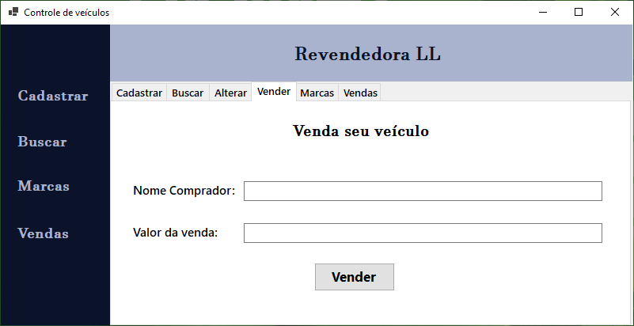
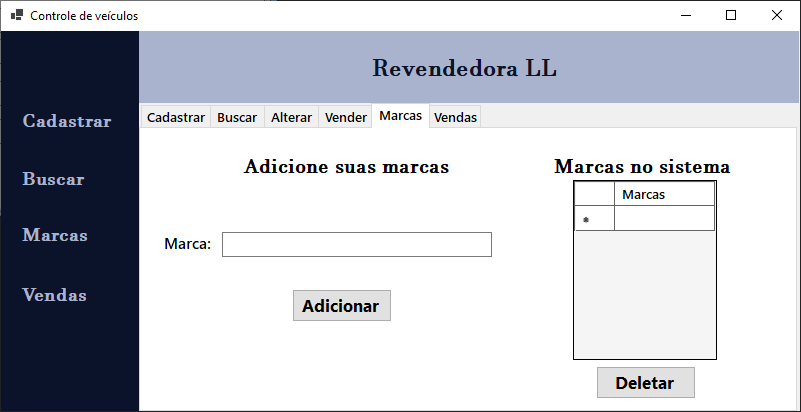
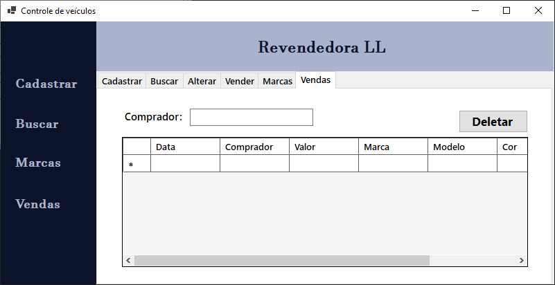

<h1 align="center">Revendedora LL</h1>
<h2 align='center'>Sistema desenvolvido em C# conectado a um Banco de Dados em SQL</h2>

<h3>Linguagens Utilizadas:</h3>
- C#
 
- SQL
 

<h4>Resumo do Sistema:</h4>
O sistema atende a ideia de uma revendedora de veículos, onde o propietário pode cadastrar seus veículos, alterar e deletar se necessário, também sendo possível registrar vendas, de forma que ele possa ver os automóveis que ele tem em estoque cadastrados e os que ja foram vendidos.

<h4>Ferramentas Utilizadas:</h4>
- Microsoft Visual Studio
 
- MySql Workbench
 
- Wampp Server
 

<h4>Funções do Software:</h4>
- Inserir dados;
 
- Alterar dados;
 
- Remover dados;
 

<h3 align='center'>Telas</h3>

<b>
Tela de Login:
</b>
<figure>
  
</figure>
 

<b>
Tela de Cadastro:
</b>
<figure>
  
</figure>
 

<b>
Tela de Cadastro de veículo:
</b>
<figure>
  
</figure>
 

<b>
Tela de Busca de veículo:
</b>
<figure>
  
</figure>
 

<b>
Tela de Alteração de veículo:
</b>
<figure>
  
</figure>
 

<b>
Tela de Venda de veículo:
</b>
<figure>
  
</figure>
 

<b>
Tela de Marcas de veículo:
</b>
<figure>
  
</figure>
 

<b>
Tela de Busca de vendas:
</b>
<figure>
  
</figure>

