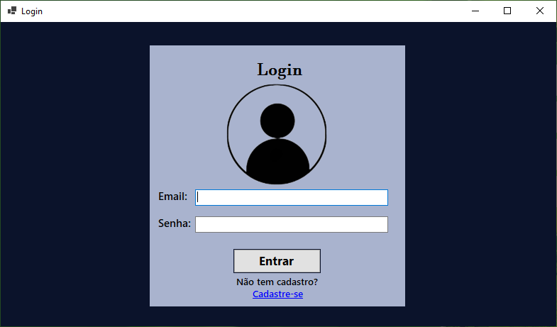
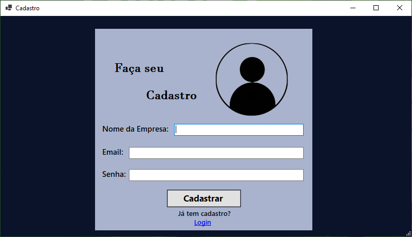
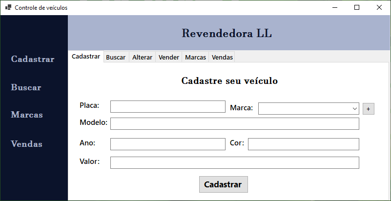
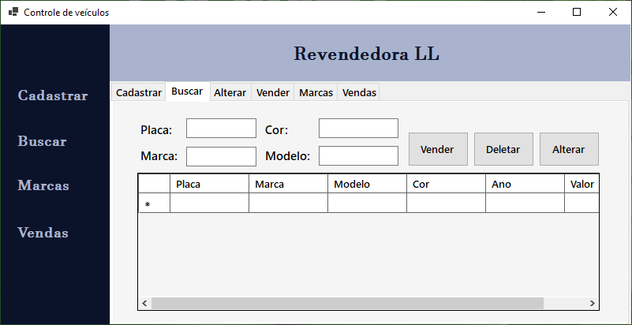
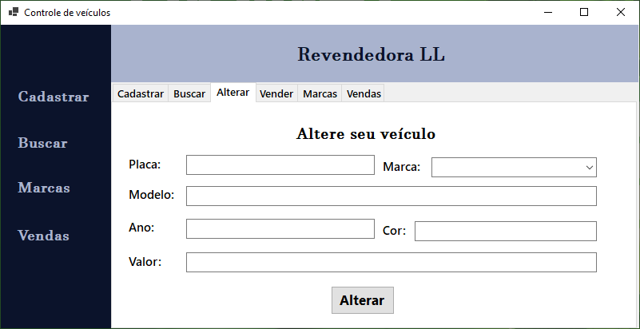

<h1 align="center">Revendedora LL</h1>
<h3 align='center'>Sistemas desenvolvido em C# conectado com Banco de Dados !</h2>

<h4>Linguagens Utilizadas:</h3>
* C#
 
* SQL
 

<h4>Ferramentas Utilizadas:</h4>
* Microsoft Visual Studio
 
* MySql Workbench
 
* Wampp Server
 

<h4>Funções do Software:</h4>
* Inserir dados;
 
* Alterar dados;
 
* Remover dados;
 

<h3 align='center'>Telas</h3>

Tela de Login:

<figure>
  
</figure>

Tela de Cadastro:

<figure>
  
</figure>

Tela de Cadastro de veículo:

<figure>
  
</figure>

Tela de Busca de veículo:

<figure>
  
</figure>

Tela de Alteração de veículo:

<figure>
  
</figure>

